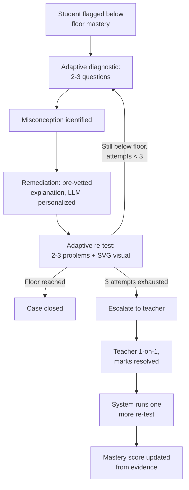

# Nirelle — Business Requirements Document

2026-09-17 · @Someone

## Executive summary

Nirelle is a recency-weighted Bayesian Knowledge Tracing (BKT) engine fused with LLM-based conversational tutoring, targeting the mid-unit gap window: the period after a teacher teaches a topic but before the class test, when a struggling student can still be brought up to a minimum mastery floor. The product is B2B2C, sold to schools on a per-student annual license, targeting the YC Winter 2027 batch application.

The founder, Sayan Biswas, previously redesigned Mindspark (Educational Initiatives), giving direct founder-market fit in Indian K-12 adaptive learning.

## Problem statement

Classic BKT uses a fixed learning rate, so it reacts slowly to recent shifts in a student's performance. Nirelle uses recency-weighted BKT (per Agarwal et al., 2020, tested on ASSISTments and Mindspark datasets) so recent attempts shift the mastery estimate faster than classic BKT allows, and pairs that signal with LLM tutoring that adapts its explanation style to the detected mastery/recency shift, not just re-serving same-difficulty questions.

The underlying technique (recency-weighted BKT, and BKT+LLM fusion generally) is established academic and even hobbyist open-source territory, not proprietary. The defensible wedge is execution: productizing this specifically for the mid-unit intervention window, tied to a teacher's actual testing calendar, with a full teacher/parent workflow wrapped around it. No commercial competitor was found to automate this specific window.

## Competitive landscape

| Player | Model | Knowledge tracing | Mid-unit gap window |
| --- | --- | --- | --- |
| Flint (YC-backed, $15M Series A) | B2B, schools/districts, LMS/SIS integration | Not disclosed (generic "adaptive engine") | Not confirmed |
| Miyagi Labs (YC-backed, $500K seed) | B2C, exam prep (SAT/ACT/NEET/CAT) | Not disclosed | Not applicable (exam prep, not foundational skills) |
| IXL | B2B, schools | Real-time assessment/SmartScore analytics | Not confirmed |
| PowerSchool | B2B, schools | Personalized-learning gap dashboards | Not confirmed |
| Khanmigo | B2B/B2C hybrid | 7-day mastery progress summaries | Not confirmed |
| Mindspark (Educational Initiatives) | B2B2C, schools, India-scale | Heuristic/rule-based (as built) | Not designed for this window |

An open-source project ("adaptive-knowledge-graph" by developer Konstantin Perikov, GitHub handle MysterionRise) combines Knowledge Graphs, local LLMs, and Bayesian skill tracking, confirming the fusion concept is unclaimed only at the hobbyist level, not defensible as IP. Manual verification of that repo's maturity (stars, license, code quality) is an open task.

**Sources**: [Agarwal, Baker & Muraleedharan, "Dynamic Knowledge Tracing through Data Driven Recency Weights," EDM 2020](https://educationaldatamining.org/files/conferences/EDM2020/papers/paper_8.pdf) · [MysterionRise/adaptive-knowledge-graph (GitHub, MIT license)](https://github.com/MysterionRise/adaptive-knowledge-graph)

## Product scope: the remediation loop

Requirements per stage:

- **Diagnostic**: BKT engine decides question count (2-3) based on confidence and curriculum context.
- **Remediation content**: drawn from a small pre-vetted library of explanation strategies per misconception type, not freshly LLM-generated; LLM handles only the personalization layer (wording, examples, language) to control inference cost.
- **Re-test**: short adaptive Q&A (2-3 problems) targeting the exact misconception, paired with an auto-generated SVG visual (number line, fraction bar, etc.), which doubles as a demo visual element.
- **Loop cap**: 2-3 diagnose-remediate-re-test cycles before escalation.
- **Sub-skill scope for MVP**: hand-built knowledge components for one grade and one subject/chapter only (no generalized curriculum-decomposition engine).

## Teacher and parent facing requirements

**Teacher escalation view** (triggered after the loop cap is reached): not a raw data dump. Must show the specific sub-skill/misconception identified, the remediation already attempted and attempt count, and a precise, personalized summary of exactly what to target in a 1-on-1 with that child, so the teacher walks in prepared. The teacher remains the final decision-maker; the system only suggests. Marking a case "resolved" triggers one automatic re-test so the mastery score updates from evidence, not the teacher's say-so.

**Parent-facing view**: a separate, high-level report, not the full misconception-level diagnostic detail given to teachers. Shows what's gone wrong at a simple level plus 1-2 concrete at-home actions, so parent and teacher can both intervene.

## Data architecture and multi-tenancy

The schema must be multi-tenant aware from the start, since the product is sold per-school. It splits into two layers:

| Layer | Scope | Contents |
| --- | --- | --- |
| Curriculum layer | Global, tenant-agnostic | Sub-skill ID, name, grade, subject, chapter, prerequisite links, pre-vetted explanation strategy library |
| Student-state layer | Per-tenant, strictly isolated | Student profile, mastery score per sub-skill, attempt/diagnostic history, teacher escalations, parent reports; every record carries a school ID and class/section ID |

**Isolation model for MVP**: row-level tenant isolation in a single shared database (every query filtered by school ID), chosen for build speed within the 6-week timeline for one pilot school. Physical per-school database isolation is a possible future upgrade if a school contractually demands it.

## Anti-cheating / integrity requirements

No single signal is decisive on its own; the system combines four:

1. **Response-time outliers** — flagged only when suspiciously fast on a hard question, or erratic (fast/slow/fast) within a session, not from raw response time alone.
2. **Answer-pattern-vs-difficulty mismatch** — acing hard questions while missing easy ones in the same session.
3. **Browser focus-loss / tab-switch detection** — a hard signal if built as a web app.
4. **Mastery-prediction mismatch** — the BKT engine predicted low mastery, but the student aces the re-test with an atypical timing/pattern; the divergence itself is the flag.

## Business model and pricing

**Model**: B2B2C. The school is the paying customer, not parents directly, on a yearly per-student ("per-seat") license. Modeled on Flint's structure (teachers always free; schools pay per-student above a free threshold). Chosen over flat/usage-based pricing because usage volume and exploitation risk are hard to predict upfront.

**Cost basis** (full curriculum: math, science, English, social studies, second language; 30-40% target margin, conservative linear infra-scaling assumption since real infra numbers are not yet built):

| Item | Value |
| --- | --- |
| Raw cost per student/year | \~$61 |
| Target price at 30% margin | \~$87 |
| Target price at 40% margin | \~$102 |

**Market benchmarks** (per student/year, full or near-full curriculum):

| Product | Price | Notes |
| --- | --- | --- |
| Mindspark | \~$180 at pilot scale | Projected to drop below \~$24/year at scale |
| DreamBox | $20-30 | Math + reading only, not full curriculum |
| iReady | $6-34 per subject | Full 5-subject load could run $30-170+ |
| Toppr / Extramarks | $190-380 | Includes live classes/video (heavier cost base) |

The $87-102/student/year working number sits below the Indian D2C players and toward the lower-middle of the US adaptive-learning benchmark range.

## Market sizing and penetration

India's total student population is over 260 million across more than a million schools and universities. Against that base:

| Player | Scale | Approx. penetration |
| --- | --- | --- |
| Mindspark | \~80,000 active annual students (private schools, historical); Ei supports 500,000+ students nationwide, 300,000+ across 13 states in classrooms | <1% |
| Extramarks | 6,000,000+ learners | \~2% |

Even the largest incumbent, Extramarks, holds only around 2% penetration. This is read as validating a large, structurally under-penetrated market with room for a focused wedge product even against established incumbents, rather than a market already claimed by a dominant player.

## MVP scope and open items

**Locked for MVP**: remediation loop, teacher escalation, parent view, anti-cheating signal set, multi-tenant schema, full-curriculum pricing target ($87-102/student/year), 6-week build, one pilot school.

**Open items**:

- [ ] Grade, subject, and chapter to hand-build for the demo
- [ ] Manual verification of the MysterionRise/adaptive-knowledge-graph repo (stars, license, code maturity)
- [ ] Go-to-market and first-pilot-school strategy (deferred to a separate session)
- [ ] Exact demo build scope for interview day
- [ ] Founder/co-founder plan: solo founder currently; informally gauging interest among trusted colleagues, no formal recruiting commitment before a YC decision
